# Uitgebreide Flowchart van de PLC Software

```mermaid
flowchart TD
    %% Hoofdstatussen van de PLC
    Main[Start PLC] --> Init["-10: Initialisatie"]
    Init --> Idle["0: Idle"]
    
    %% Decision node voor automatische modus
    Idle --> IdleDecision{{"Auto Mode?"}}
    IdleDecision -->|"Ja"| Ready["10: Ready - Waiting for Job"]
    IdleDecision -->|"Nee"| Idle
    
    %% Jobvalidatieproces met decision nodes
    Ready --> ReadyDecision{{"Job Request?\n(Eco_iTaskType > 0)"}}
    ReadyDecision -->|"Nee"| Ready
    ReadyDecision -->|"Ja"| Validate["25: Job Validatie"]
    
    Validate --> ValidateDecision{{"Is Job Valid?"}}
    ValidateDecision -->|"Ja"| Accept["30: Assignment Accepted"]
    ValidateDecision -->|"Nee"| Reject["650: Assignment Rejected"]
    Reject --> Ready
    
    %% Afhandeling op basis van taaktype (decision node)
    Accept --> JobTypeDecision{{"Taaktype?"}}
    JobTypeDecision -->|"Type = 1\n(FullAssignment)"| FullStart["Full Assignment Flow"]
    JobTypeDecision -->|"Type = 2\n(MoveToAssignment)"| MoveToStart["300: MoveTo Flow"]
    JobTypeDecision -->|"Type = 3\n(PreparePickUp)"| PrepareStart["400: PreparePickup Flow"]
    JobTypeDecision -->|"Invalid Type"| Error["888: Error State"]
    
    %% Full Assignment Workflow (Ophalen + Afleveren) met decision nodes
    subgraph FullAssignment[Full Assignment Flow]
        direction TB
        FA_Start["Start FullAssignment"] --> FA_Handshake1["100: Wait GetTray Handshake"]
        FA_Handshake1 --> FA_HandshakeDecision1{{"Handshake\nOK?"}}
        FA_HandshakeDecision1 -->|"Nee"| FA_Handshake1
        FA_HandshakeDecision1 -->|"Ja"| FA_CheckForks["101: Check Forks"]
        
        FA_CheckForks --> FA_ForkMiddleDecision{{"Forks middle?"}}
        FA_ForkMiddleDecision -->|"Nee"| FA_MoveForks["Move Forks Middle"]
        FA_ForkMiddleDecision -->|"Ja"| FA_MoveOrigin["102-105: Move to Origin"]
        FA_MoveForks --> FA_CheckForks
        
        FA_MoveOrigin --> FA_ArrivedDecision{{"At Origin?"}}
        FA_ArrivedDecision -->|"Nee"| FA_MoveOrigin
        FA_ArrivedDecision -->|"Ja"| FA_ForkPrep["150-153: Forks to Pickup Side"]
        
        FA_ForkPrep --> FA_ForksReadyDecision{{"Forks at Side?"}}
        FA_ForksReadyDecision -->|"Nee"| FA_ForkPrep
        FA_ForksReadyDecision -->|"Ja"| FA_Pickup["155-156: Pickup Tray (+ Offset)"]
        
        FA_Pickup --> FA_PickupDoneDecision{{"Pickup Complete?"}}
        FA_PickupDoneDecision -->|"Nee"| FA_Pickup
        FA_PickupDoneDecision -->|"Ja"| FA_ForkMid1["160-163: Forks to Middle"]
        
        FA_ForkMid1 --> FA_ForkMid1Decision{{"Forks Middle?"}}
        FA_ForkMid1Decision -->|"Nee"| FA_ForkMid1
        FA_ForkMid1Decision -->|"Ja"| FA_EndPickup["199: Pickup Phase Complete"]
        
        FA_EndPickup --> FA_Handshake2["201: Wait SetTray Handshake"]
        FA_Handshake2 --> FA_HandshakeDecision2{{"Handshake\nOK?"}}
        FA_HandshakeDecision2 -->|"Nee"| FA_Handshake2
        FA_HandshakeDecision2 -->|"Ja"| FA_MoveDest["202-205: Move to Destination"]
        
        FA_MoveDest --> FA_DestDecision{{"At Destination?"}}
        FA_DestDecision -->|"Nee"| FA_MoveDest
        FA_DestDecision -->|"Ja"| FA_ForkPlace["250-253: Forks to Place Side"]
        
        FA_ForkPlace --> FA_ForkPlaceDecision{{"Forks at Side?"}}
        FA_ForkPlaceDecision -->|"Nee"| FA_ForkPlace
        FA_ForkPlaceDecision -->|"Ja"| FA_PlaceTray["255-256: Place Tray (Exact)"]
        
        FA_PlaceTray --> FA_PlaceDecision{{"Tray Placed?"}}
        FA_PlaceDecision -->|"Nee"| FA_PlaceTray
        FA_PlaceDecision -->|"Ja"| FA_ForkMid2["260-263: Forks to Middle"]
        
        FA_ForkMid2 --> FA_ForkMid2Decision{{"Forks Middle?"}}
        FA_ForkMid2Decision -->|"Nee"| FA_ForkMid2
        FA_ForkMid2Decision -->|"Ja"| FA_JobDone["299: Full Job Complete"]
        
        FA_JobDone --> FA_ClearDecision{{"Job Cleared by\nEcoSystem?"}}
        FA_ClearDecision -->|"Nee"| FA_JobDone
        FA_ClearDecision -->|"Ja"| FA_Return[Return to Ready]
    end
    
    %% MoveTo Assignment Workflow met decision nodes
    subgraph MoveToFlow[MoveTo Assignment Flow]
        direction TB
        MT_Start["300: Start MoveTo Task"] --> MT_CheckPos["Check Current Position"]
        MT_CheckPos --> MT_AtDestDecision{{"Already at\nDestination?"}}
        MT_AtDestDecision -->|"Ja"| MT_Done["399: MoveTo Complete"]
        MT_AtDestDecision -->|"Nee"| MT_ReachCalc["Calculate Reach"]
        
        MT_ReachCalc --> MT_ShaftCheck["Check Shaft Availability"]
        MT_ShaftCheck --> MT_ShaftDecision{{"Shaft Free?"}}
        MT_ShaftDecision -->|"Nee"| MT_Wait["Wait for Free Shaft"]
        MT_ShaftDecision -->|"Ja"| MT_Move["Move to Destination"]
        MT_Wait --> MT_ShaftCheck
        
        MT_Move --> MT_MoveCompleteDecision{{"Move Complete?"}}
        MT_MoveCompleteDecision -->|"Nee"| MT_Move
        MT_MoveCompleteDecision -->|"Ja"| MT_Arrive["Arrived at Destination"]
        MT_Arrive --> MT_Done
        
        MT_Done --> MT_ClearDecision{{"Job Cleared by\nEcoSystem?"}}
        MT_ClearDecision -->|"Nee"| MT_Done
        MT_ClearDecision -->|"Ja"| MT_Return[Return to Ready]
    end
    
    %% PreparePickup Workflow met decision nodes
    subgraph PrepareFlow[PreparePickup Flow]
        direction TB
        PP_Start["400: Start PreparePickup Task"] --> PP_Handshake["100: Wait GetTray Handshake"]
        PP_Handshake --> PP_HandshakeDecision{{"Handshake\nOK?"}}
        PP_HandshakeDecision -->|"Nee"| PP_Handshake
        PP_HandshakeDecision -->|"Ja"| PP_MoveOrigin["101-105: Move to Origin"]
        
        PP_MoveOrigin --> PP_OriginDecision{{"At Origin?"}}
        PP_OriginDecision -->|"Nee"| PP_MoveOrigin
        PP_OriginDecision -->|"Ja"| PP_ForkPrep["150-153: Forks to Pickup Side"]
        
        PP_ForkPrep --> PP_ForkDoneDecision{{"Forks at Side?"}}
        PP_ForkDoneDecision -->|"Nee"| PP_ForkPrep
        PP_ForkDoneDecision -->|"Ja"| PP_Done["499: PreparePickup Complete"]
        
        PP_Done --> PP_ClearDecision{{"Job Cleared by\nEcoSystem?"}}
        PP_ClearDecision -->|"Nee"| PP_Done
        PP_ClearDecision -->|"Ja"| PP_Return[Return to Ready]
    end
    
    %% Error afhandeling met decision node
    Error --> ErrorClearDecision{{"Clear Error?\n(xClearError = true)"}}
    ErrorClearDecision -->|"Nee"| Error
    ErrorClearDecision -->|"Ja"| Init
    
    %% Validatieproces gedetailleerd met decision nodes
    subgraph ValidationProcess[Validation Process Detail]
        direction TB
        ValStart["Start Validation"] --> ReachCalc["Calculate Own Reach"]
        ReachCalc --> OtherReach["Get Other Lift's Reach"]
        OtherReach --> OverlapCheck{{"Reach Overlap with\nActive Other Lift?"}}
        OverlapCheck -->|"Ja"| FailCross["Fail: Lifts Cross"]
        
        OverlapCheck -->|"Nee"| OriginCheck{{"Origin/Dest=0 for\nFullAssignment?"}}
        OriginCheck -->|"Ja"| FailParams["Fail: Invalid Parameters"]
        OriginCheck -->|"Nee"| MovePrepCheck{{"Origin=0 for\nMoveTo/Prepare?"}}
        MovePrepCheck -->|"Ja"| FailParams
        
        MovePrepCheck -->|"Nee"| TrayCheck{{"Pickup job but\nTray Present?"}}
        TrayCheck -->|"Ja"| FailTray["Fail: Tray Conflict"]
        
        TrayCheck -->|"Nee"| DestCheck{{"Destination in\nRange for Lift?"}}
        DestCheck -->|"Nee"| FailRange["Fail: Beyond Lift Range"]
        DestCheck -->|"Ja"| DestPosCheck{{"Destination > 0?"}}
        DestPosCheck -->|"Nee"| FailInvalid["Fail: Invalid Destination"]
        
        DestPosCheck -->|"Ja"| OriginRangeCheck{{"Origin in Range?"}}
        OriginRangeCheck -->|"Nee"| FailOrRange["Fail: Origin Out of Range"]
        
        OriginRangeCheck -->|"Ja"| ValidSuccess["Validation Success"]
        
        %% Resultaten verzamelen
        FailCross --> ValidationResult["Set Validation Result"]
        FailParams --> ValidationResult
        FailTray --> ValidationResult
        FailRange --> ValidationResult
        FailInvalid --> ValidationResult
        FailOrRange --> ValidationResult
        ValidSuccess --> ValidationResult
    end
    
    Validate --> ValidationProcess
    
    %% Fork bewegingen (SubFunctie) met decision nodes
    subgraph ForkMovement[Fork Movement SubFunction]
        direction TB
        ForkReq["iReqForkPos Request"] --> ForkCheck{{"Already at\nTarget Position?"}}
        ForkCheck -->|"Ja"| ForkDone["Fork Movement Complete"]
        ForkCheck -->|"Nee"| ForkMove["Move Forks to Target"]
        ForkMove --> ForkTimeCheck{{"Movement Time\nElapsed?"}}
        ForkTimeCheck -->|"Nee"| ForkMove
        ForkTimeCheck -->|"Ja"| ForkDone
    end
    
    %% Engine bewegingen (SubFunctie) met decision nodes
    subgraph EngineMovement[Engine Movement SubFunction]
        direction TB
        EngReq["iToEnginGoToLoc Request"] --> EngCheck{{"Already at\nLocation?"}}
        EngCheck -->|"Ja"| EngDone["Engine Movement Complete"]
        EngCheck -->|"Nee"| EngOffsetCheck{{"Offset\nRequested?"}}
        EngOffsetCheck -->|"Ja"| EngMoveOffset["Move to Location with Offset"]
        EngOffsetCheck -->|"Nee"| EngMoveExact["Move to Exact Location"]
        
        EngMoveOffset --> EngTimeCheck1{{"Movement Time\nElapsed?"}}
        EngTimeCheck1 -->|"Nee"| EngMoveOffset
        EngTimeCheck1 -->|"Ja"| EngDone
        
        EngMoveExact --> EngTimeCheck2{{"Movement Time\nElapsed?"}}
        EngTimeCheck2 -->|"Nee"| EngMoveExact
        EngTimeCheck2 -->|"Ja"| EngDone
    end

    %% Speciale transities bij fouten
    Ready --> |"Hardware Error"| Error
    FA_MoveOrigin --> |"Movement Error"| Error
    FA_Pickup --> |"Pickup Error"| Error
    FA_MoveDest --> |"Movement Error"| Error
    FA_PlaceTray --> |"Placement Error"| Error
    
    %% Connectie van subfuncties met hoofdprocessen
    FA_ForkPrep -.-> ForkMovement
    FA_ForkMid1 -.-> ForkMovement
    FA_ForkPlace -.-> ForkMovement
    FA_ForkMid2 -.-> ForkMovement
    FA_MoveOrigin -.-> EngineMovement
    FA_Pickup -.-> EngineMovement
    FA_MoveDest -.-> EngineMovement
    FA_PlaceTray -.-> EngineMovement
    
    MT_Move -.-> EngineMovement
    
    PP_ForkPrep -.-> ForkMovement
    PP_MoveOrigin -.-> EngineMovement
    
    %% Legenda met ruitvormige decision nodes
    classDef idle fill:#f9f,stroke:#333,stroke-width:2px
    classDef ready fill:#bbf,stroke:#333,stroke-width:2px
    classDef error fill:#f99,stroke:#333,stroke-width:2px
    classDef validation fill:#bfb,stroke:#333,stroke-width:2px
    classDef movement fill:#feb,stroke:#333,stroke-width:2px
    classDef handshake fill:#bff,stroke:#333,stroke-width:2px
    classDef decision fill:#ffe,stroke:#333,stroke-width:2px,shape:diamond
    
    class Idle,Init idle
    class Ready ready
    class Error error
    class Validate,ValidationProcess validation
    class FA_MoveOrigin,FA_Pickup,FA_MoveDest,FA_PlaceTray,MT_Move,PP_MoveOrigin,EngineMovement movement
    class FA_Handshake1,FA_Handshake2,PP_Handshake handshake
    class IdleDecision,ReadyDecision,ValidateDecision,JobTypeDecision,FA_HandshakeDecision1,FA_HandshakeDecision2,FA_ForkMiddleDecision,FA_ArrivedDecision,FA_ForksReadyDecision,FA_PickupDoneDecision,FA_ForkMid1Decision,FA_DestDecision,FA_ForkPlaceDecision,FA_PlaceDecision,FA_ForkMid2Decision,FA_ClearDecision,MT_AtDestDecision,MT_ShaftDecision,MT_MoveCompleteDecision,MT_ClearDecision,PP_HandshakeDecision,PP_OriginDecision,PP_ForkDoneDecision,PP_ClearDecision,ErrorClearDecision,OverlapCheck,OriginCheck,MovePrepCheck,TrayCheck,DestCheck,DestPosCheck,OriginRangeCheck,ForkCheck,ForkTimeCheck,EngCheck,EngOffsetCheck,EngTimeCheck1,EngTimeCheck2 decision
```

## Flowchart Toelichting

Deze verbeterde flowchart geeft een gedetailleerde visualisatie van de statemachine-logica in de PLC software zoals geïmplementeerd in PLCSim.py, nu met duidelijke beslissingspunten (decision nodes).

### Hoofdcycli

1. **Initialisatie (-10)**: De PLC begint in de initialisatiefase, waarbij alle variabelen worden gereset en subsystemen worden gecontroleerd.
2. **Idle (0)**: Wacht op het inschakelen van de automatische modus (decision node hier toegevoegd).
3. **Ready (10)**: Klaar om opdrachten te ontvangen, met decision node voor het controleren of er een nieuwe taak is.

### Jobvalidatie (Cycle 25)

De validatie is nu duidelijk opgesplitst met decision nodes voor elke validatiestap:
- **Liftbereik en Overlap**: Decision node voor potentiële conflicten met andere lift.
- **Parameterconsistentie**: Decision nodes voor oorsprong en bestemmingswaardes.
- **Bereikvalidatie**: Decision node voor controle of de bestemming binnen het bereik van de lift valt.
- **Traysituatie**: Decision node voor controle van de huidige traysituatie.

### Taaksoorten

Decision node voor het kiezen van de werkstroom op basis van het taaktype:

1. **FullAssignment (Type 1)**: Complete taak met ophalen en afleveren, nu met decision nodes voor elke stap.
2. **MoveToAssignment (Type 2)**: Verplaatsingstaak met decision nodes voor positie- en beschikbaarheidscontroles.
3. **PreparePickUp (Type 3)**: Voorbereidingstaak met decision nodes voor handshake en positiecontroles.

### Subfuncties

Ook de subfuncties hebben nu decision nodes:

1. **Motor/Lift Beweging**: Beslissingspunten voor positie, offsetverplaatsing en tijdscontrole.
2. **Vorkbewegingen**: Beslissingspunten voor huidige positie en bewegingsstatus.

### Foutafhandeling

- **Error Cycle 888**: Met decision node voor het controleren of een fout is opgelost.

Deze verbeterde flowchart toont nu duidelijk alle beslissingen in de PLC-logica met ruitvormige beslissingspunten die standaard zijn in flowchartnotatie.